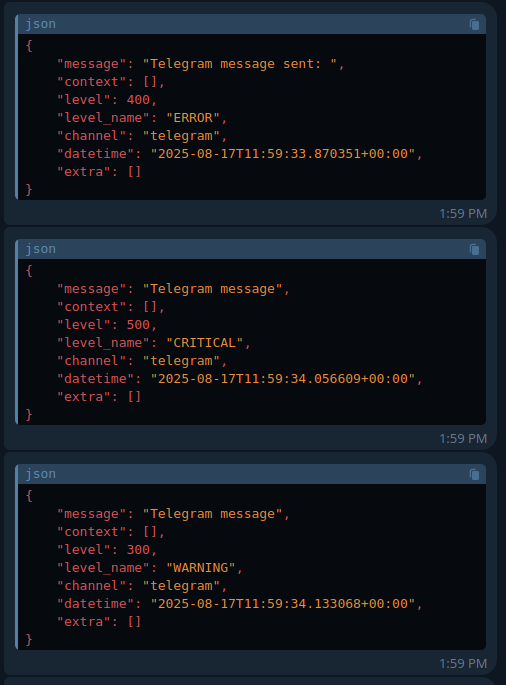

# Telegram Logs Monitor for Laravel

[](https://packagist.org/packages/uzhlaravel/telegramlogs)


[](https://packagist.org/packages/uzhlaravel/telegramlogs)

Monitor your Laravel application logs in real-time through Telegram. This package delivers instant notifications of critical events directly to your Telegram channel, with support for threaded discussions and Markdown formatting.

## Key Features

- **Real-time log delivery** to Telegram channels
- **One-command installation** with guided setup
- **Configuration testing** before deployment
- **Configurable log levels** (emergency to debug)
- **Threaded discussions** support via Telegram topics
- **MarkdownV2** formatted messages
- **JSON** formatted messages
- **Automatic message splitting** for long logs
- **Customizable timeout** for API calls
- **Test command** to verify your setup

## Prerequisites

Before installation, you'll need:
1. A Telegram bot token (create one via [BotFather](https://core.telegram.org/bots#botfather))
2. A Telegram channel/group chat ID
3. Laravel 8.0+ application

## Installation

Install the package via Composer:

```bash
composer require uzhlaravel/telegramlogs
```

Run the installation command for guided setup:

### One-command Installation

```bash
php artisan telegramlogs:install
```

This will:
1. Publish the configuration file
2. Guide you through environment setup
3. Optionally set Telegram as your default log channel
4. Test your configuration

### Manual Installation 

Publish the configuration file:

```bash
php artisan vendor:publish --tag="telegramlogs-config"
```


## Configuration

### Automated Setup

The installation command will guide you through setting up:

```bash
php artisan telegramlogs:install
```

### Manual Configuration


Update your `.env` file with these settings:

```ini
TELEGRAM_BOT_TOKEN=your_bot_token_here
TELEGRAM_CHAT_ID=your_chat_id_here
# Optional settings:
TELEGRAM_TOPIC_ID=your_thread_id_here
TELEGRAM_LOGS_LEVEL=error
```

### Available Log Levels

| Level      | Description                          |
|------------|--------------------------------------|
| Debug      | Detailed debug information          |
| Info       | Informational messages               |
| Notice     | Normal but significant events       |
| Warning    | Warning conditions                  |
| Error      | Error conditions                    |
| Critical   | Critical conditions                 |
| Alert      | Immediate action required           |
| Emergency  | System is unusable                  |

### Logging Configuration

Set your default log channel in `.env`:

```ini
LOG_CHANNEL=telegram
```

## Usage

### Basic Logging

```php
// Basic error logging
\Log::error('Payment processing failed');

// Exception handling
try {
    // Your code
} catch (\Exception $e) {
    \Log::critical('API Connection Failed: ' . $e->getMessage());
}

// Debug messages
\Log::debug('User authenticated', ['user_id' => auth()->id()]);
```

### Command Line Tools

#### Test Configuration

```bash
php artisan telegramlogs:test
```

Options:
- `--message="Custom message"` - Send custom test message
- `--level=error` - Specify log level
- `--list` - Show available log levels
- `--config` - Display current configuration

Example with custom message:
```bash
php artisan telegramlogs:test --message="System check" --level=warning
```

#### Show Configuration

```bash
php artisan telegramlogs:test --config
```

## Expected Output

Messages in your Telegram channel will appear as formatted JSON:

```json
{
    "message": "Database connection failed",
    "level": "CRITICAL",
    "datetime": "2025-08-17T11:55:13.885292+00:00",
    "context": {
        "exception": "PDOException: could not find driver"
    }
}
```



## Getting Telegram Credentials

1. **Create a Bot**: Visit [BotFather](https://core.telegram.org/bots#botfather) to create your bot and get the API token
2. **Get Chat ID**: Add your bot to a channel/group and visit:
   ```
   https://api.telegram.org/bot<YOUR_BOT_TOKEN>/getUpdates
   ```
3. **Enable Topics** (optional): Create a topic in your group to get the topic_id

## Security Considerations

- Keep your bot token secure
- Restrict bot access to specific chats
- Review [our security policy](../../security/policy) for vulnerability reporting

## Changelog

See [CHANGELOG](CHANGELOG.md) for version history.

## Contributing

We welcome contributions! Please see [CONTRIBUTING](CONTRIBUTING.md) for guidelines.

## License

MIT License. See [LICENSE](LICENSE.md) for details.

## Credits

- [Uzziahlukeka](https://github.com/Uzziahlukeka/telegrammonitor)
- [All Contributors](../../contributors)
